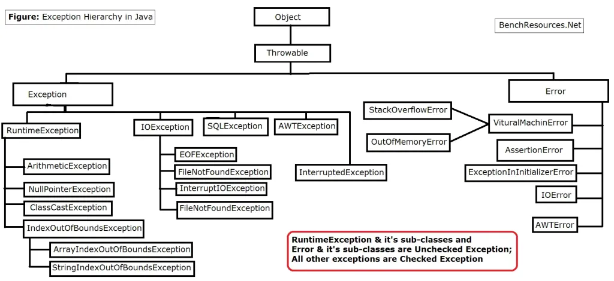

# Exception flow in Inheritance

### Examples of Exceptions
#### Checked Exception :
Exception -> 
- IOException -> FileNotFoundException
- ClassNotFoundException

#### Un-Checked Exception :
Exception -> RuntimeException -> IndexOutOfBoundsException ->
- ArrayIndexOutOfBoundsException
- StringIndexOutOfBoundsException

#### Java Exception Diagram:

### Scenarios
1. Parent does not declare exception
    - Child does not declare exception -> Normal execution
    - Child declares CHECKED exception -> Compile time error *"overridden method does not throw 'xyz-Exception'"*
    - Child declares Un-CHECKED exception -> Normal execution

2. Parent declares CHECKED exception
   - Child does not declare exception -> Normal execution
   - Child declares CHECKED exception of SAME or DERIEVED type -> Normal execution
   - Child declares CHECKED exception of DIFFERENT type -> *"overridden method does not throw 'xyz-Exception'"*
   - Child declares Un-CHECKED exception -> Normal execution

3. Parent declares UN-CHECKED exception
    - Child does not declare exception -> Normal execution
    - Child declares CHECKED exception -> *"overridden method does not throw 'xyz-Exception'"*
    - Child declares UN-CHECKED exception of SAME or DERIEVED type -> Normal execution
    - Child declares UN-CHECKED exception of DIFFERENT type -> Normal execution

### Conclusion
1. If the parent is throwing any exception, the child need not throw it.
2. The ONLY rule is for CHILD class throwing CHECKED exceptions -> The parent should have thrown a same or parent CHECKED exception as well.

